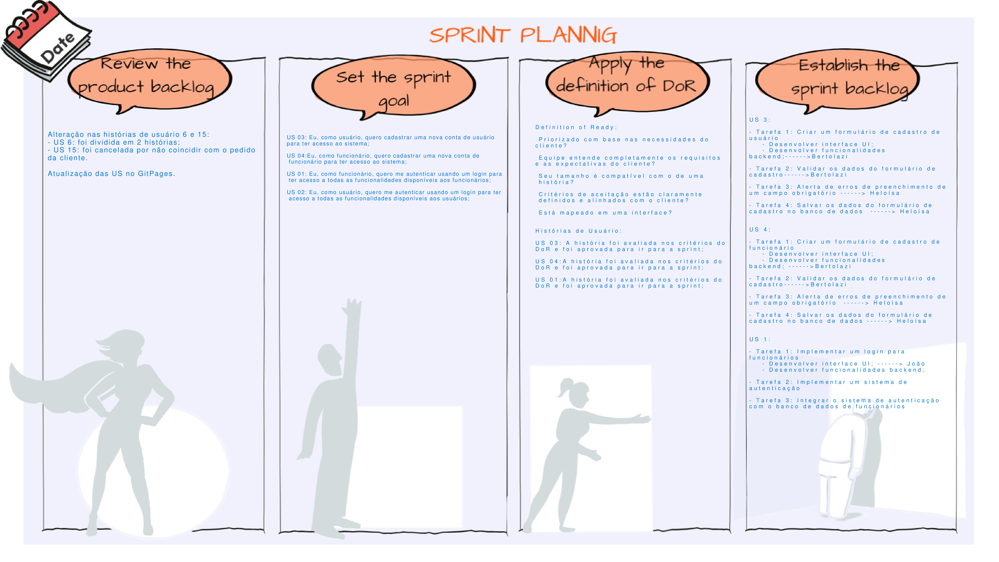

# Sprint 1

Data:  07/11/2023  -  21/11/2023

Na Sprint 1, ocorreu a confecção dos critérios de avaliação das histórias do MVP1, efetuamos a composição das tarefas das histórias de usuário e desenvolvemos as US 1, 2, 3 e 4.

## Sprint

| Sprint |  |
| --- | --- |
| Sprint Planning - Goal | Desenvolver cadastro (US 3 e 4); |
|  | Desenvolve autenticação (US 1 e 2); |
|  | Produzir recuperação de senha (US 5);|
|  | Elaborar Próximas Consultas (US 8); |
|  | Entregas da Unidade 03. |
| Backlog da Sprint | Aprendizado de Integração Contínua; |
|  | US 03: Eu, como usuário, quero cadastrar uma nova conta de usuário para ter acesso ao sistema; |
|  | US 04: Eu, como funcionário, quero cadastrar uma nova conta de funcionário para ter acesso ao sistema; |
|  | US 01: Eu, como funcionário, quero me autenticar usando um login para ter acesso a todas as funcionalidades disponíveis aos funcionários; |
|  | US 02: Eu, como usuário, quero me autenticar usando um login para ter acesso a todas as funcionalidades disponíveis aos usuários. |
| Sprint Review | Aprovação da cliente e feedback para que haja uma mudança no cadastro (mudando o CPF pelo número de telefone) e mudança na autenticação (usar o e-mail como usuário); |
Prioridade para o próximo MVP: realizar mais US’s e conciliar melhor o tempo. |
| Histórias não realizadas | US 5 e 8;
|  | Justificativa: por conta de problemas técnicos com a plataforma de desenvolvimento e com a plataforma de integração o tempo estimado da sprint não foi o suficiente para a confecção de todas as histórias propóstas pelo grupo. |
| Sprint Retrospective | Pontos positivos: integração entre os membros, bastante interesse e trabalho em equipe por parte de todos, desenvolvimento fluido do front end, ritmo saudável e programação em pares; |
|  |Pontos negativos: uso devido dos testes, adaptação às tecnologias, má interpretação sobre como seria feita a entrega, conciliação do manejo de tempo; |
|  |Melhorias para a próxima sprint: melhor planejamento da sprint, conciliar melhor o tempo disponível, aumentar o número de histórias a serem feitas para evitar atraso ou entrega incompleta. |

## Pair Programming realizado:

| Dupla | Descrição do que foi realizado | Data |
| --- | --- | --- |
| Vinícius/João Lucas | - Estudo sobre flutter e git | 10/11/2023 |
| Heloísa/Gabriel | - Programação Backend | 11/11/2023 |
| Vinícius/João Lucas | - Programação Frontend | 14/11/2023 |
| Heloísa/Gabriel | - Desenvolvimento do banco de dados | 14/11/2023 |
| Emivalto/Caio | - Modais de alerta | 17/11/2023 |
| Vinícius/Emivalto | - Solução de problemas com o framework | 21/11/2023 |
| Gabriel/João Lucas | - Solução de problemas de integração | 21/11/2023 |

## Template da Sprint Planning

## Template da Retrospectiva

## Template do Review da Sprint

## Reunião de deliberação com cliente
[Vídeo da reunião](https://drive.google.com/file/d/19xnRxK5q0yaLe7Fc2eH_EVp4PDiDAoT3/view?usp=sharing)