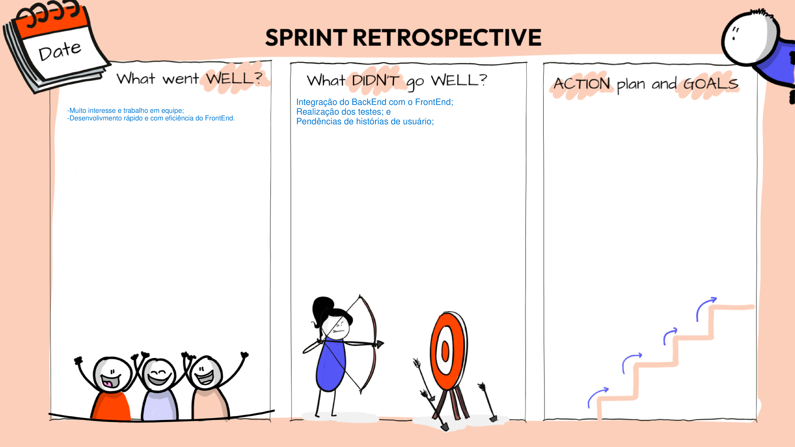

# Sprint 2

Data:  21/11/2023  -  13/11/2023

Na Sprint 2, ocorreu a confecção dos critérios de avaliação das histórias do MVP2, efetuamos a integração contínua, as pendências da Sprint 1 e o MVP2.

## Critérios de Aceitação

### MVP 2

2.1. Marcar Eventos

- `US6:` Eu, como funcionário, quero ver eventos futuras para me preparar de acordo;
    - O funcionário deve ser capaz de visualizar eventos futuros em um calendário;
    - O calendário deve mostrar pelo menos mês e semana;
    - O calendário deve conter as seguintes informações: data, hora e título;

- `US7:` Eu, como funcionário, marcar eventos futuras para me preparar de acordo;
    - O funcionário deve ser capaz de criar um novo evento.

- `US9:` Eu, como funcionário, quero poder desmarcar eventos para maximizar eficiência da clínica;
    - O funcionário deve ser capaz de desmarcar um evento existente.

- `US10:` EU, como funcionário, quero poder alterar dados de eventos para maximizar a eficiência da clínica;
    - O funcionário deve ser capaz de editar um evento existente.

2.2. Consultar Marcações

- `US8:` Eu, como usuário, quero poder me informar sobre datas de consultas marcadas para evitar cancelamentos e inconveniências;
    - O usuário deve ser capaz de visualizar uma lista de suas consultas marcadas.

2.3. Documentar Hábitos Alimentares

- `US11:` Eu, como funcionário, quero dar feedback de forma consistente sobre os hábitos alimentares de pacientes individuais;
    - O funcionário deve ser capaz de visualizar os hábitos alimentares de um paciente individual.
    - O funcionário deve ser capaz de fornecer feedback sobre os hábitos alimentares do paciente.

- `US12:` Eu, como usuário, quero registrar meus hábitos alimentares para ajudar em decisões sobre meu tratamento;
    - O usuário deve ser capaz de registrar seus hábitos alimentares.
    - Os hábitos alimentares registrados devem ser visíveis para o funcionário.

- `US13:` Eu, como funcionário, quero me informar sobre os hábitos alimentares diários de pacientes afim de personalizar e ajustar os tratamentos;
    - O funcionário deve ser capaz de visualizar os hábitos alimentares diários de um paciente.

2.4. Disponibilizar Conteúdos

- `US14:` Eu, como funcionário, quero distribuir conteúdos educativos de forma rápida para múltiplos pacientes, afim de evitar mandar os conteúdos individualmente;
    - O funcionário deve ser capaz de enviar conteúdos educativos para múltiplos pacientes.

3.1. Comunicar com Nutricionista

- `US15:` Eu, como funcionário, quero me comunicar de forma privada com pacientes afim de manter a confidencialidade médica;
    - A comunicação entre funcionário e paciente deve ser privada.

3.2. Notificar Usuário

- `US16:` Eu, como funcionário, quero ser capaz de notificar pacientes com informações ao longo do dia afim de reforçar e facilitar o tratamento;
    - As notificações devem ser enviadas de forma oportuna.
    - As notificações devem ser relevantes para o tratamento do paciente.

## Sprint

| Sprint Planning - Goal | Marcar Eventos (US 06, US 07, US 09, US 10);
Consultar marcações (US 08);
Documentar Hábitos Alimentares (US 11, US 12, US 13);
Disponibilizar Conteúdos (US 14);
Comunicar com Nutricionista (US 15);
Notificar Usuário (US 16);
Pendências da Sprint 1;
Testes Unitários, de integração, de sistema e de Aceitação. |
| --- | --- |
| Backlog da Sprint | US’s 6, 7, 9, 10, 8, 14;
Pendências;
Testes unitários e de aceitação; |
| Sprint Review | Foram feitos os critétiros de avaliação e a definição de DoD em cada uma das funcionalidades e obtivemos a aprovação da cliente; |
| Pendências | US’s 11, 12, 13, 15, 16;
Justificativa: por conta do tempo corrido e de acabarem acontecendo muitos erros no framework, na integração contínua e na instalação de pacotes para o desenvolvimento dessas funcionalidades, nós não conseguimos realizar as histórias de usuário. |
| Sprint Retrospective | Pontos positivos: muito interesse e trabalho em equipe, desenvolivmento rápido e com eficiência do FrontEnd;
Pontos negativos: Integração do BackEnd com o FrontEnd, realização dos testes e pendências de histórias de usuário; |

## Pair Programming realizado:

| Dupla | Descrição | Data |
| --- | --- | --- |
| João Lucas e Emivalto | Programação FrontEnd | 23/11/2023 |
| João Lucas e Emivalto | Programação FrontEnd | 24/11/2023 |
| Gabriel e Heloísa | Programação BackEnd | 30/11/2023 |
| Gabriel e Heloísa | Programação BackEnd | 03/12/2023 |
| Caio e Vinícius | Testes Unitários | 05/12/2023 |
| João Lucas e Emivalto | Programação FrontEnd | 11/12/2023 |
| Gabriel e Heloísa | Programação BackEnd | 12/12/2023 |

## Template da Sprint Planning

## Template da Retrospectiva

## Template do Review da Sprint

