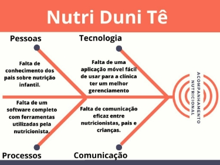

# Unidade 1

**Visão de produto e projeto**

## **1 VISÃO GERAL DO PRODUTO**

### 1.1 **Problema**

*Atualmente no cenário de nutrição ainda temos dietas que são passadas por papel ou PDF, dificultando a praticidade de acompanhamento da dieta do usuário, além da necessidade de utilizar várias plataformas (como agenda, chat, diário, blog), por isso existe a necessidade da clínica de deter um sistema de acompanhamento que seja de fácil manuseio e tenha todas as funções que são usadas em aplicativos distintos, minimizando o desmembramento de recursos quanto ao gerenciamento da clínica. Com isso o blog da nutricionista tem como objetivo ajudar os pais que não conhecem muito sobre nutrição infantil, e com as dicas dadas no mesmo o cliente pode ter uma ajuda sem precisar marcar uma consulta.*

### 1.2 **Declaração de Posição do Produto**

*O produto busca atender as necessidades específicas da clínica em questão. Oferecendo o uso de diversas ferramentas diferentes em um só aplicativo. Logo, gerando uma experiência personalizada e com a interação direta do profissional encarregado do serviço prestado ao usuário.*

|Para|Nutri Duni Tê|
| - | - |
|Quem|Letícia dona da clínica Nutri Duni Tê|
|O (nome do produto)|Nutri Duni Tê|
|Que|Facilita a cliente em ter todas as ferramentas em um só aplicativo  |
|Ao contrário|Uso das alternativas genéricas disponibilizadas na internet|
|Nosso produto|Facilita o gerenciamento da clínica por meio da junção de ferramentas que são de uso constante da nutricionista|

### 1.3 **Objetivos do Produto**

*Criar um  aplicativo onde o cliente pode ter várias plataformas que hoje são utilizadas para fazer sua organização em uma só, com isso a cliente pode ter maior nível de organização pessoal e tornar a experiência dos clientes da clínica mais agradável, com o fim de fidelizar o mesmo.*

### 1.4 **Tecnologias a Serem Utilizadas**

Serão utilizadas as tecnologias: Flutter, para o desenvolvimento do aplicativo, Kanban no GitHub para gerenciamento e gestão do projeto, o discord para reunião entre os participantes do grupo e o zoom para reunião com a cliente, para back-end usaremos python e Django Rest Framework, e para testes github action e dart.

## **2 VISÃO GERAL DO PROJETO**

### 2.1 **Organização do Projeto**

|***Papel***|***Atribuições***|***Responsável***|***Participantes***|
| - | - | - | - |
|*Desenvolvedor Front-end*|*Codificar o produto, com foco na interface, e refatoração*|*João Lucas*|*Todos*|
|*Desenvolvedor Back-end*|*Codificar o produto com foco na funcionalidade*|*Heloísa*|*Todos*|
|*Desenvolvedor Back-end*|*Codificar o produto, com foco na funcionalidade*|*Gabriel Bertolazi*|*Todos*|
|*Dev CI/test*|*Executar testes unitários, executar testes de integração e de aceitação*|*Caio Pacheco*|*Todos*|
|*Dev CI/test*|*Codificar o produto, garantir a integração contínua.*|*Emivalto*|*Todos*|
|*Scrum Master*|*Gerenciar as práticas do SCRUM e se comunicar diretamente com a cliente*|*Vinícius*|*Vinícius*|
|*Cliente*|*Auxiliar no reconhecimento de estórias de usuário*|*Leticia*|*Leticia*|

### 2.2 **Planejamento das Fases e/ou Iterações do Projeto**

|***Sprint***|***Produto (Entrega)***|***Data Início***|***Data Fim***|
| - | - | - | - |
|*Sprint 0*|*Definição do Produto, MVP e Planejamento do Projeto*|*05/09/23*|*12/10/23*|
|*Sprint 1*|*US 3,4,1 e 2*|*07/11/23*|*21/11/23*|
|*Sprint 2*|*US 6,13,7 e 5*|*22/11/23*|*13/12/23*|

### 2.3 **Matriz de Comunicação**

|***Descrição***|***Área/ Envolvidos***|***Periodicidade***|***Produtos Gerados***|
| - | :- | - | - |
|Definição de Sprint e próximos objetivos, acompanhar o andamento geral do projeto|Toda equipe|Quinzenalmente| Ata de reunião|
|Discussão sobre possíveis desafios e soluções apresentados pelos membros|Toda equipe, monitores|Semanalmente|Relatório de situação do projeto|
|Reunião com o cliente e entrega parcial|Toda a equipe, cliente|Quinzenalmente|Ata de reunião e validação da entrega|
|Comunicação assíncrona entre os membros da equipe|Toda a equipe, cliente, monitores|comforme necessário|Mensagens de texto|

### 2.4 **Gerenciamento de Riscos**

*Gerenciamento de riscos*

*Identificar riscos*

O primeiro passo é identificar os possíveis riscos que podem afetar o projeto. Esses riscos podem ser internos, como falta de recursos ou atrasos no cronograma, ou externos, como mudanças nas regulamentações ou desastres naturais.

No caso deste projeto, os seguintes riscos foram identificados:

- *Atrasos no cronograma:* O projeto pode atrasar devido a imprevistos, como problemas técnicos ou mudanças de requisitos.
- *Problemas técnicos:* O projeto pode ser afetado por problemas técnicos, como falhas no software ou no hardware.

*Mitigação de riscos*

Uma vez identificados os riscos, é necessário desenvolver ações para mitigá-los. Essas ações podem ser preventivas, como a realização de pesquisas de engajamento, ou corretivas, como a criação de planos de contingência.

*Revisão de riscos*

A lista de riscos deve ser revisada periodicamente para garantir que ainda seja válida. No caso deste projeto, a lista de riscos será revisada a cada sprint.

*Registro de riscos*

Todos os riscos identificados e mitigados devem ser registrados para que possam ser facilmente consultados. No caso deste projeto, os riscos serão registrados no Painel de Controle e no Plano do Projeto.

### 2.5 **Critérios de Replanejamento**
- *Atraso nas entregas*
- *Aumento do escopo do projeto*
- *Feedback negativo dos usuários que exija ajustes substanciais*

## **3 PROCESSO DE DESENVOLVIMENTO DE SOFTWARE**

### **3.1 Fases do Fluxo de Trabalho e seus Frameworks de Origem**

#### 1. **Sprint Planning**
- **Descrição:** *Serão planejadas as atividades a serem executadas. Para isso, o Dono do Produto, o Scrum Master e a equipe de desenvolvimento se reúnem a fim de estabelecer os objetivos e as tarefas do sprint.*

- **Framework de Origem:** *Scrum*
#### 2. **Desenvolvimento**
- **Descrição:** *Durante esta fase, a equipe de desenvolvimento trabalha nas tarefas definidas durante o Sprint Planning. É aqui que a codificação, testes e integração acontecem.*

- **Framework de Origem:** *Scrum para a estrutura do sprint e XP para práticas de desenvolvimento como programação em pares e Test-Driven Development (TDD)*

#### 3. **Revisão**
- **Descrição:** *Durante essa etapa, é realizada uma revisão do que foi alcançado no sprint pela equipe e pela cliente. Geralmente, são realizados testes de aceitação e é feita a revisão do código.*

- **Framework de Origem:** *Scrum*
#### 4. **Retrospectiva**
- **Descrição:** *Depois de concluída a revisão, a equipe se junta para debater sobre os pontos positivos, as oportunidades de melhoria e as formas de implementar avanços no próximo sprint.*

- **Framework de Origem:** *Scrum*
#### 5. **Nova Sprint**
- **Descrição:** *Com base nas lições aprendidas e no feedback recebido, a equipe inicia um novo ciclo de sprint. O processo recomeça com o Sprint.*

*Planning.*

- **Framework de Origem:** *Scrum*

|***Nome da Atividade***|***Método***|***Ferramenta***|***Entrega***|
| - | - | - | - |
|*Definição de Objetivos da Sprint*|*Planejamento de Objetivos*|*Discord/GitHub Projects*|*Objetivos da Sprint*|
|*Construção de Backlog*|*Planejamento de Sprint*|*Zoom*|*Backlog da Sprint*|
|*Atribuição de Tarefas*|*Planejamento de Tarefas*|*Discord/GitHub Projects*|*Tarefas atribuídas*|
|*Codificação*|*Pair Programming*|*Dart*|*Código Funcional*|
|*Desenvolvimento de Testes*|*Desenvolvimento Orientado a Testes*|*VS Code*|*Testes Unitários*|
|*Integração Contínua*|*CI/CD*|*Discord/Github*|*Workflow de integração contínua*|
|*Revisão de Código*|*Revisão por pares*|*VS Code*|*Melhorias de código*|
|*Testes de Aceitação*|*Testes de usabilidade*|*GitHub Actions*|*Testes de Aceitação Passados*|
|*Retrospectiva*|*Revisão de Sprint*|*Discord*|*Ações de melhorias*|
|*Documentação*|*Documentação Incremental*|*Microsoft word*|*Documentação*|
|*Planejamento do Próximo Sprint*|*Planejamento de objetivos*|*Discord/GitHub Projects*|*Objetivos para a próxima Sprint*|

## **4 LIÇÕES APRENDIDAS**

1. **Unidade 1**

*Nessa unidade passamos por algumas dificuldades, em relação a organização e documentação do projeto, com isso entendemos que devemos usar de forma eficiente nossas 
plataformas de organização, e usar nosso tempo livre para aprender as tecnologias que iremos usar em nosso projeto, para assim consiguiremos apresentar um melhor trabalho
nas próximas unidades.*

## Histórico de Revisão

|Data|Versão|Descrição|Autor|
| - | - | - | - |
|**20/09/2023**|**1.0**|**Rascunho de Visão do Produto e Projeto**|**Caio Pacheco**|
|**27/09/2023**|**1.1**|**Revisão de gramática**|**Gabriel Bertolazi**|
|**08/10/2023**|**1.2**|**Revisão de Visão do Produto**|**Vinícius**|
|**24/10/2023**|**1.3**|**Refatoração Geral**|**Gabriel Bertolazi**|
|**26/10/2023**|**1.4**|**Correções Finais**|**Caio Pacheco**|
|**10/12/2023**|**1.5**|**Mudança nas tecnologias**|**Vinícius Fernandes**|
|**13/12/2023**|**1.6**|**Correção do Planejamento**|**Vinícius Fernandes**|

## **REFERÊNCIAS BIBLIOGRÁFICAS**

*Slides do Professor do módulo em questão*

*YouTube - Canal Eduardo Mendes para documentação*

*Chat GPT - Para algumas dúvidas no markdown*

*.* 

*Aqui está um breve vídeo para apresentar nosso projeto dessa unidade*

[Vídeo retrospectiva unidade 1](https://youtu.be/GkmLpQHu1Rk)
