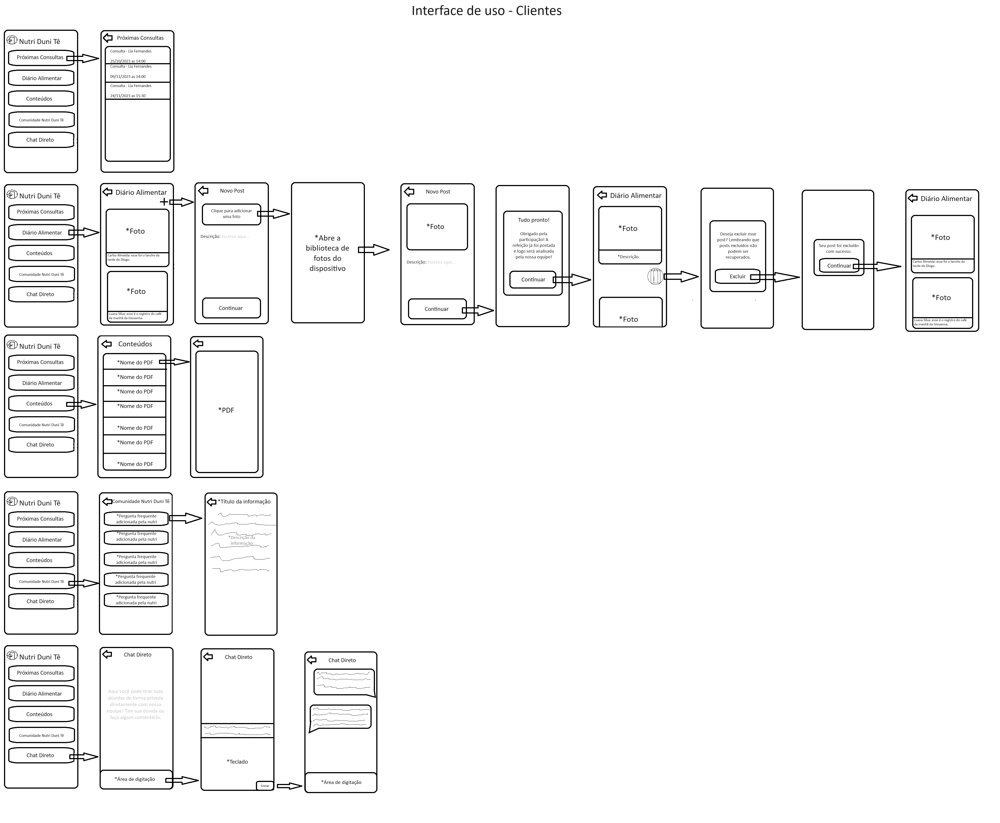
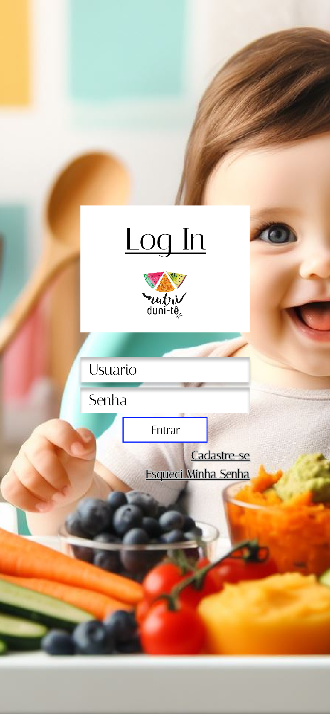
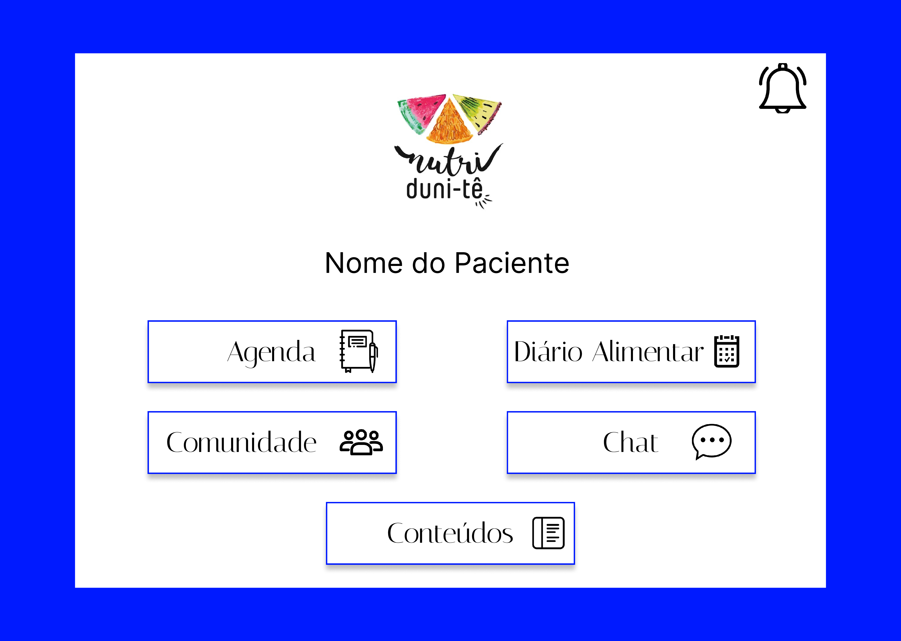
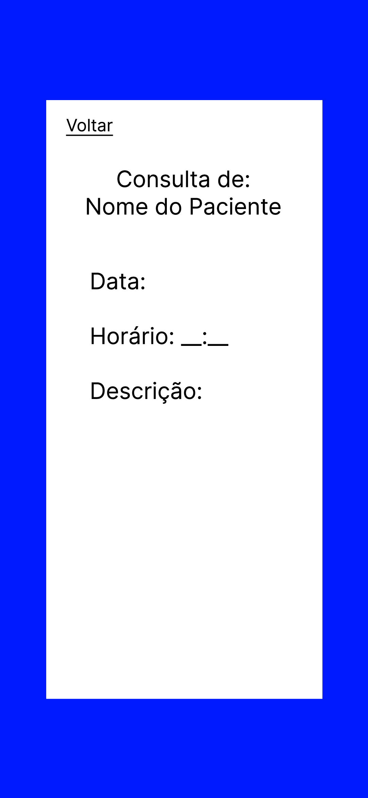
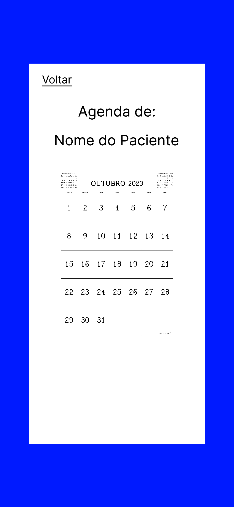
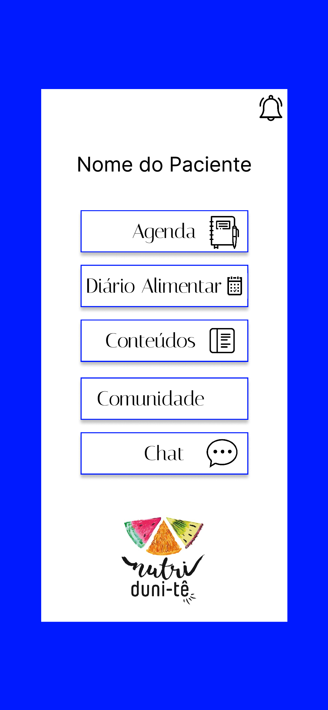

# Unidade 2

## Requisitos Funcionais

### Cadastrar Usuário:

> Deve ser possível criar uma nova conta, com usuário e senha. A conta pode ser de paciente ou funcionário. A conta de funcionário deve ser criada com um código de acesso.

### Autenticar Usuário:

> Deve ser possível entrar na conta, usando o usuário e senha. A conta pode ser de paciente ou funcionário.

### Recuperar Senha:

> Deve ser possível recuperar a senha da conta, usando o e-mail cadastrado.

### Marcar Eventos:

> Deve ser possível marcar eventos na agenda, como consultas e reuniões. Devem ser registrados o título, a data, o tipo e a descrição do evento. Deve ser possível editar e apagar eventos.

### Consultar Marcações:

> Deve ser possível consultar os eventos marcados na agenda.

### Documentar Hábitos Alimentares:

> Deve ser possível documentar os hábitos alimentares em um diário alimentar. Devem ser registrados o título, a data, e a descrição do hábito. Como funcionário, deve ser possível dar feedback sobre os hábitos alimentares de pacientes individuais.

### Diponibilizar Conteúdos:

> Deve ser possível disponibilizar conteúdos educativos para os pacientes em um mural público. Devem ser registrados o título, a descrição e o arquivo do conteúdo.

### Contatar Comunidade:

> Deve ser possível contatar outros pacientes e funcionários por meio de um fórum para compartilhar experiências e se conectar.

### Comunicar com Nutricionista:

> Deve ser possível contatar o nutricionista por meio de um chat privado. Deve ser possível enviar mensagens de texto e imagens.

### Notificar Usuário:

> Deve ser possível notificar os pacientes com informações e dicas ao longo do dia. Devem ser registrados o título, a data, a hora e a descrição da notificação a ser enviada.

## *Temas - Épicos - Histórias*

### *Tema 1: Autenticação e Identificação*

1.1. Cadastrar Usuário

- `US3:` Eu, como usuário, quero cadastrar uma nova conta de usuário para ter acesso ao sistema;
- `US4:` Eu, como funcionário, quero cadastrar uma nova conta de funcionário para ter acesso ao sistema;

1.2. Autenticar Usuário

- `US1:` Eu, como funcionário, quero me autenticar usando um login para ter acesso a todas as funcionalidades disponíveis aos funcionários;
- `US2:` Eu, como usuário, quero me autenticar usando um login para ter acesso a todas as funcionalidades disponíveis aos usuários;

1.3. Recuperar Senha

- `US5:` Eu, como usuário geral, quero ser capaz de escolher uma nova senha para garantir que meu acesso ao sistema não será perdido;

### *Tema 2: Recursos de Gerenciamento de Informações*

2.1. Marcar Eventos

- `US6:` Eu, como funcionário, quero ver eventos futuras para me preparar de acordo;
- `US7:` Eu, como funcionário, marcar eventos futuras para me preparar de acordo;
- `US9:` Eu, como funcionário, quero poder desmarcar eventos para maximizar eficiência da clínica;
- `US10:` EU, como funcionário, quero poder alterar dados de eventos para maximizar a eficiência da clínica;

2.2. Consultar Marcações

- `US8:` Eu, como usuário, quero poder me informar sobre datas de consultas marcadas para evitar cancelamentos e inconveniências;

2.3. Documentar Hábitos Alimentares

- `US11:` Eu, como funcionário, quero dar feedback de forma consistente sobre os hábitos alimentares de pacientes individuais;
- `US12:` Eu, como usuário, quero registrar meus hábitos alimentares para ajudar em decisões sobre meu tratamento;
- `US13:` Eu, como funcionário, quero me informar sobre os hábitos alimentares diários de pacientes afim de personalizar e ajustar os tratamentos;

2.4. Disponibilizar Conteúdos

- `US14:` Eu, como funcionário, quero distribuir conteúdos educativos de forma rápida para múltiplos pacientes, afim de evitar mandar os conteúdos individualmente;

### *Tema 3: Comunicação*

3.1. Comunicar com Nutricionista

- `US15:` Eu, como funcionário, quero me comunicar de forma privada com pacientes afim de manter a confidencialidade médica;

3.2. Notificar Usuário

- `US16:` Eu, como funcionário, quero ser capaz de notificar pacientes com informações ao longo do dia afim de reforçar e facilitar o tratamento;

## Críterio de Priorização das Histórias de Usuário

### Atributos

 As histórias de usuário (**US**) serão priorizadas levando em conta 3 atributos:

- **`C` - Complexidade:** *nível de trabalho necessário para desenvolver a US*
- **`V` - Valor de Negócio:** *o valor que a US agrega no produto*
- **`D` - Dependência:** *o quão dependente a US é em histórias pré-requisitas*

### Fórmula

As US serão analisadas, então os atributos `C` e `V`  serão classificados com uma nota entre 0 e 10, e o atributo `D` classificado entre 0 e 5. Esses valores serão passados para um função que determina o score final `S` da US: `S = (10*V-5*C)/(10+2*D)`

Essa fórmula quantifica custo benefício de desenvolvimento de cada US. O valor de negócio é a base nota, sendo penalizada negativamente por complexidade e escalada negativamente por dependência. Histórias serão desenvolvidas por ordem decrescente de score. Dessa forma, histórias com maior valor, baixa complexidade e baixa dependência são desenvolvidas primeiro.

### Resultado

|       | **Complexidade**  `C`| **Valor de negócio**  `V`| **Dependencia**  `D`| **Score**  `S`|
|---------|:----------------:|:--------------------:|:---------------:|:-----------:|
| **US 1**  | 3                | 8                    | 1               | 5.41 |
| **US 2**  | 3                | 8                    | 1               | 5.41 |
| **US 3**  | 2                | 7                    | 0               | 6.0   |
| **US 4**  | 2                | 7                    | 0               | 6.0   |
| **US 5**  | 7                | 9                    | 1               | 4.58 |
| **US 6**  | 5                | 10                   | 2               | 5.35 |
| **US 7**  | 5                | 9                    | 2               | 4.64 |
| **US 8**  | 6                | 9                    | 2               | 4.28 |
| **US 9**  | 4                | 7                    | 2               | 3.57 |
| **US 10** | 5                | 5                    | 2               | 1.78 |
| **US 11** | 3                | 6                    | 2               | 3.21 |
| **US 12** | 4                | 7                    | 1               | 4.16 |
| **US 13** | 6                | 9                    | 1               | 5.0   |
| **US 14** | 4                | 6                    | 1               | 3.33 |
| **US 15** | 4                | 7                    | 1               | 4.16 |

## MVP 1

Para a escolha de US que serão desenvolvidas no MVP 1, escolhemos as 8 histórias com os maiores scores, sendo elas:

|       | **Complexidade**  `C`| **Valor de negócio**  `V`| **Dependencia**  `D`| **Score**  `S`|
|---------|:----------------:|:--------------------:|:---------------:|:-----------:|
| **US 3**  | 2                | 7                    | 0               | 6.0   |
| **US 4**  | 2                | 7                    | 0               | 6.0   |
| **US 1**  | 3                | 8                    | 1               | 5.41 |
| **US 2**  | 3                | 8                    | 1               | 5.41 |
| **US 6**  | 5                | 10                   | 2               | 5.35 |
| **US 13** | 6                | 9                    | 1               | 5.0   |
| **US 7**  | 5                | 9                    | 2               | 4.64 |
| **US 5**  | 7                | 9                    | 1               | 4.58 |

## MVP 2

Para as US que serão desenvolvidas no MVP 2, serão todas que não estão (ou não foram completadas) no MVP 1, sendo elas:

|       | **Complexidade**  `C`| **Valor de negócio**  `V`| **Dependencia**  `D`| **Score**  `S`|
|---------|:----------------:|:--------------------:|:---------------:|:-----------:|
| **US 8**  | 6                | 9                    | 2               | 4.28 |
| **US 12** | 4                | 7                    | 1               | 4.16 |
| **US 15** | 4                | 7                    | 1               | 4.16 |
| **US 9**  | 4                | 7                    | 2               | 3.57 |
| **US 14** | 4                | 6                    | 1               | 3.33 |
| **US 11** | 3                | 6                    | 2               | 3.21 |
| **US 10** | 5                | 5                    | 2               | 1.78 |

## Requisitos Não-Funcionais

### *Usabilidade:*

1. Deve-se organizar a interface de forma clara, onde a clareza reside no fato de que o título do menu/seção indica com precisão o que está contido em seu conteúdo.
2. Garantir a adaptação a diferentes tamanhos de tela, contando que usem uma das proporções compatíveis.
3. Garantir a adaptação a diferentes dispositivos, contando que o navegador e sistema operacional seja compatível.

### *Confiabilidade:*

1. Durante a execução de ações, a taxa de erro do sistema não deve exceder ``8%``.

### *Desempenho:*

1. Deve ser assegurado que o tempo médio de resposta do sistema não exceda ``1200ms``.

### *Segurança:*

1. Todas as senhas/credenciais, com exeção de nomes de usuário, deverão ser armazenadas em ``hash`` e nunca em texto pleno.

### *Restrições de Design:*

1. O aplicativo mobile deverá ser menor que ``250mb``.

### *Compatibilidade:*

1. Garantir a compatibilidade com telas de proporção ``9:16``, ``16:9``, ``18:9``, ``19:9``.
2. Em dispositivos mobile, garantir a compatibilidade com dispositivos usando ``Android 8.0`` ou versões mais recentes.
3. Em dispositivos desktop, a aplicação deverá funcionar corretamente nos browsers ``Chrome`` e ``Edge`` em suas versões recentes

### *Implementação:*

1. O produto deve ser uma aplicação web e mobile.
2. O front-end do produto deve ser desenvolvido utilizando o framework ``Flutter``.
3. O back-end do produto deve ser desenvolvido utilizando ``Python`` e ``Django Rest Framework``.

## Definição de Ready

- O requisito deve ser priorizado com base nas necessidades do cliente.
- A equipe deve entender completamente os requisitos e as expectativas do cliente.
- Os épicos devem ser quebrados em histórias de usuário e estimados.
- Os recursos necessários devem estar disponíveis.
- Os critérios de aceitação devem estar claramente definidos e alinhados com o cliente.
- O requisito deve estar mapeado para uma interface.

## Definição de Done

- O código passou nos testes unitários, garantindo que as funcionalidades individuais funcionem corretamente.
- O código passou nos testes de integração, garantindo que todas as partes do sistema funcionem juntas.
- Os critérios de aceitação acordados com o PO foram atendidos.
- A funcionalidade foi testada em vários cenários para garantir que esteja livre de defeitos.
- O código foi revisado por todos os membros da equipe para garantir a qualidade e a consistência.
- A documentação foi atualizada e está disponível para referência futura.

## Arquitetura do Software

O tipo de arquitetura definida foi a de aplicativos multiplataforma, tendo em vista que os membros da equipe não tem muita experiência em desenvolvimento de aplicativos esse tipo se mostrou vantajoso. Ademais, ao considerar o tempo disponível para o desenvolvimento o compartilhamento de código propiciado por esse tipo de arquitetura pareceu útil.
Já o estilo arquitetural escolhido foi o  ``MVC`` (Model-View-Controller), que é o estilo recomendado pelo framework escolhido (flutter). Além disso, a separação da apresentação e interação dos dados do sistema entre model view e controller apresenta complexidade mais simples de código do que os outros estilos.

## Design do Software

### Princípios de UI

- **Aprendizagem:**  interface sujestiva, aonde para entrar em qualquer uma das funcionalidades que estarão disponíveis já na tela de início bastará um único clique, além de que dentro de cada uma delas também com no máximo 5 cliques o usuário conseguirá realizar a ação desejada, sendo:
  - *Agenda:* necessário 5 cliques para adicionar um novo evento ou 4 cliques para apagar um evento;
  - *Próximas consultas:* necessário somente o clique de entrada;
  - *Diário alimentar:* 5 cliques para adicionar algo novo, caso cliente, e 3 para apagar, ou 2 cliques para a nutricionista responder o post;
  - *Aba de conteúdos:* somente 1 clique para o cliente escolher o pdf, caso cliente, 5 para a nutricionista adicionar um novo conteúdo e 4 para apagar;
  - *Comunidade Nutri Duni Tê:* apenas 2 cliques para os clientes e para a nutricionista 3 cliques para adicionar algo novo;
  - *Chat Direto:* somente dois cliques para ambos os usuários;
  - *Notificações:* 4 cliques para a nutricionista enviar uma nova notificação;

- **Familiaridade do usuário:** Uso terminologia familiar, utilizar palavras e expressões que se encaixem naturalmente no vocabulário comum das pessoas;

- **Consistência:** comportamento preditível, para que os usuários prevejam o que acontecerá quando realizarem uma ação.
  - *Consistência visual:* elementos de design de maneira uniforme em toda a interface;
  - *Consistência de navegação:* o padrão no menu e nos botões de redirecionamento;
  - *Feedback do sistema:* mensagens de feedback, confirmações, erros ou mensagens de sucesso;

- **Surpresa mínima:** consistência, de forma com que as operações e ações se comportam de maneira consistente e desing intuitivo com os elementos e funcionalidades dispostos de forma lógica e coerente;
- **Recuperabilidade:** caso o usuário precise voltar para uma página que estava preenchida, ele não irá perder os dados informados, pois eles estarão lá recuperados;

- **Orientação do usuário:** uso de mensagens para orientar o usuário caso ocorra algum erro, alguma ação tenha sido realizada com sucesso ou caso esteja faltando completar algum campo obrigatório;

- **Diversidade de usuários:**
  - Uso de ferramentas de verificação de contraste, para garantir o destaque do texto e dos elementos da interface no plano de fundo, para os usuários que possuem daltonismo;
  - Legibilidade de texto, de forma que o tamanho e a fonte do texto sejam legíveis e que haja um bom contraste entre o texto e o fundo, para os usuários com baixa visão;
  - Navegação Simples, sendo necessário no máximo 5 cliques para realizar alguma ação, ajudando assim usuários que utilizem de leitores de tela;

## Modalidades de Interação

- **Resposta da questão:** caso o cliente tenha dúvida sobre o dia de sua consulta, o software lhe responde por meio da aba “Próximas Consultas”;

- **Manipulação direta:** os funcioários podem usar gestos de deslizamento (swipe) em uma agenda na tela para navegar pelos dias do mês e visualizar os dias disponíveis para agendar consultas.

- **Seleção do menu:** os usuários terão o menu já disponível na tela inicial, com todas as funcionalidades aparentes para que eles escolham em apenas um clique qual função eles querem utilizar;

- **Preenchimento de formulário:** os funcionários poderão preencher campos para marcar consultas na aba “Agenda”, escolhendo o título, horário e descrição, para adicionar títulos aos conteúdos na aba “Conteúdos”, para adicionar descrição nos seus posts na aba “Diário Alimentar” (caso clientes) ou responder os posts (caso funcionários), adicionar títulos e descrições nas informações oferecidas na aba “Comunidade Nutri Duni Tê”, para mandar alguma mensagem na aba “Chat Direto” ou para adicionar título e descrição (caso funcionários) nas notificações da aba de notificações;

## Esboço do Aplicativo

### Paint

### Figma

## Histórico de Revisão

|Data|Versão|Descrição|Autor|
| - | - | - | - |
|**21/10/2023**|**1.0**|**Rascunho de MVP 1 e 2**|**Vinícius**|
|**22/10/2023**|**1.1**|**Correções de formatação e gramática**|**Gabriel Bertolazi**|
|**23/10/2023**|**1.2**|**Rascunho da Arquitetura**|**Heloísa**|
|**25/10/2023**|**1.3**|**Revisão dos Requisitos Funcionais e dos Critérios de Priorização**|**Caio Pacheco**|
|**26/10/2023**|**1.4**|**Revisão dos Requisitos Não-funcionais e formatação**|**Caio Pacheco**|

## Lições aprendidas

2. **Unidade 2**

*Aprendemos nessa unidade a fazer de forma ideal as histórias de usuário e a definir uma arquitetura para o nosso projeto de software, além de finalmente aprendemos a fazer a documentação de um projeto de forma eficaz.*

[Vídeo retrospectiva unidade 2](https://youtu.be/GkmLpQHu1Rk)