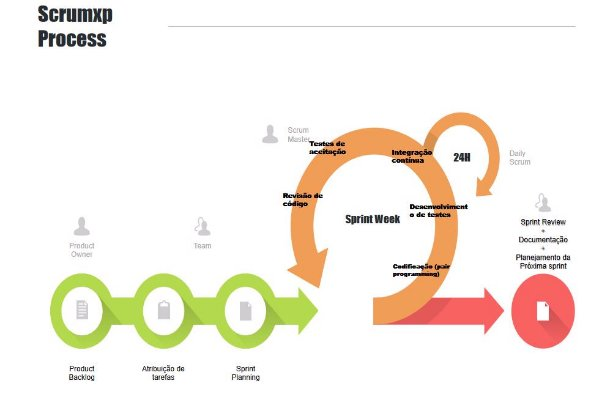

# 2023.2-SportLife
Repositório de projeto da disciplina de MDS.

**NutriDuniTê**

**VISÃO DO PRODUTO E PROJETO**

Versão [1.0]

Histórico de Revisão

|Data|Versão|Descrição|Autor|
| - | - | - | - |
|**20/09/2023**|**1.0**|**Rascunho de Visão do Produto e Projeto**|**Caio Pacheco**|
|||||
|||||
|||||
**Sumário**

[**1 VISÃO GERAL DO PRODUTO 4**](#_page3_x72.00_y109.00)

1. [Problema 4](#_page3_x72.00_y150.25)
1. [Declaração de Posição do Produto 4](#_page3_x72.00_y481.99)
1. [Objetivos do Produto 5](#_page4_x72.00_y72.00)
1. [Tecnologias a Serem Utilizadas 5](#_page4_x72.00_y134.60)

[**2 VISÃO GERAL DO PROJETO 5**](#_page4_x72.00_y203.19)

1. [Organização do Projeto 5](#_page4_x72.00_y244.44)
1. [Planejamento das Fases e/ou Iterações do Projeto 5](#_page4_x72.00_y543.58)
1. [Matriz de Comunicação 6](#_page5_x72.00_y94.10)
1. [Gerenciamento de Riscos 6](#_page5_x72.00_y295.79)
1. [Critérios de Replanejamento 6](#_page5_x72.00_y473.37)

[**3 PROCESSO DE DESENVOLVIMENTO DE SOFTWARE 6**](#_page5_x72.00_y540.03)

[3.1 Fases do Fluxo de Trabalho e seus Frameworks de Origem 6](#_page5_x72.00_y587.27)

[**4 LIÇÕES APRENDIDAS 8**](#_page7_x72.00_y436.50)

1. [Unidade 1 8](#_page7_x72.00_y483.75)
1. [Unidade 2 8](#_page7_x72.00_y563.84)
1. [Unidade 3 8](#_page7_x72.00_y649.94)
1. [Unidade 4 8](#_page8_x72.00_y72.00)

[**5 REFERÊNCIAS BIBLIOGRÁFICAS 8**](#_page8_x72.00_y155.54)

*Visão de Produto e Projeto Página 3 de 9**

**VISÃO DO PRODUTO EPROJETO**

**1 VISÃO GERAL DO PRODUTO**

1. **Problema**

*Atualmente no cenário de nutrição ainda temos dietas que são passadas por papel ou PDF, dificultando a praticidade de acompanhamento da dieta do usuário, além da necessidade de utilizar várias plataformas (como agenda, chat, diário, blog), por isso existe a necessidade da clínica de deter um sistema de acompanhamento que seja de fácil manuseio e tenha todas as funções que são usadas em aplicativos distintos, minimizando o desmembramento de recursos quanto ao gerenciamento da clínica.*

2. **Declaração de Posição do Produto**

*O produto busca atender as necessidades específicas da clínica em questão. Oferecendo o uso de diversas ferramentas diferentes em um só aplicativo. Logo, gerando uma experiência personalizada e com a interação direta do profissional encarregado do serviço prestado ao usuário.*

|Para|Nutri Duni Tê|
| - | - |
|Quem|Nutri Duni Tê|
|O (nome do produto)|Nutri Duni Tê|
|Que|Gerencia o monitoramento da empresa enquanto mantém contato profissional|
|Ao contrário|Uso das alternativas genéricas disponibilizadas na internet|
|Nosso produto|Facilita o gerenciamento da clínica por meio da junção de ferramentas que são de uso constante da nutricionista|

3. **Objetivos do Produto**

*Facilitar o controle de informações relevantes para a clínica prestar seus serviços aos clientes de forma mais simples e direta. Através de disponibilizar conteúdo sobre nutrição infantil e a formação de um cronograma.*

4. **Tecnologias a Serem Utilizadas**

Serão utilizadas as tecnologias: Flutter, para o desenvolvimento do aplicativo, Trello para gerenciamento e gestão do projeto, o discord para reunião entre os participantes do grupo e o zoom para reunião com a cliente.

**2 VISÃO GERAL DO PROJETO**

1. **Organização do Projeto**

|***Papel***|***Atribuições***|***Responsável***|***Participantes***|
| - | - | - | - |
|*Desenvolvedor Front-end*|*Codificar o produto, com foco na interface, e refatoração*|*João Lucas*|*Todos*|
|*Desenvolvedor Front-end*|*Codificar o produto, com foco na interface, e refatoração*|*Heloísa*|*Todos*|
|*Desenvolvedor Back-end*|*Codificar o produto, com foco na funcionalidade, testes unitários e refatoração*|*Gabriel Bertolazi*|*Todos*|
|*Analista de Testes*|*Codificar o produto, executar testes de integração e de aceitação*|*Caio Pacheco*|*Todos*|
|*Analista CI*|*Codificar o produto, garantir a integração contínua.*|*Emivalto*|*Todos*|
|*Scrum Master*|*Gerenciar as práticas do SCRUM e se comunicar diretamente com a cliente*|*Vinícius*|*Vinícius*|
|*Cliente*|*Auxiliar no reconhecimento de estórias de usuário*|*Leticia*|*Leticia*|

2. **Planejamento das Fases e/ou Iterações do Projeto**

|***Sprint***|***Produto (Entrega)***|***Data Início***|***Data Fim***|
| - | - | - | - |
|*Sprint 1*|*Definição do Produto*|*05/09/23*|*21/09/23*|
|*Sprint 2*|*MVP e Planejamento do Projeto*|*26/09/23*|*12/10/23*|
|*Sprint 3*|*Funcionalidades Básicas*|*17/10/23*|*02/11/23*|
|*Sprint 4*|*Funcionalidades Avançadas*|*07/11/23*|*22/11/23*|

3. **Matriz de Comunicação**

|***Descrição***|***Área/ Envolvidos***|***Periodicidade***|***Produtos Gerados***|
| - | :- | - | - |
|*- Acompanhamento das Atividades em Andamento*|*- Equipe do Projeto*|*- Semanal*|*- Ata de reunião*|
|
*- Acompanhamento dos Riscos,*

*Compromissos, Ações Pendentes, Indicadores*
|*-Equipe do Projeto -Monitores*|*- Quinzenal*|*- Relatório de situação do projeto*|
|*- Comunicar situação do projeto*|
- *Equipe do Projeto*

- *Professor*
|*- Semanal*|
- *Ata de reunião e*

- *Relatório de Situação do Projeto*
|
4. **Gerenciamento de Riscos**
- *Identificar Riscos:*
  - *Falta de engajamento dos estudantes*
  - *Atrasos no cronograma o Problemas técnicos*
- *Mitigar Riscos:*
  - *Realização de pesquisas de engajamento*
  - *Planejamento detalhado o Testes contínuos*
- *Revisão de Riscos:*
  - *A lista de riscos será revisada a cada sprint.*
- *Registro de Riscos:*

➢ *Os riscos serão registrados no Painel de Controle e no Plano do Projeto.*

5. **Critérios de Replanejamento**
- *Atraso significativo nas entregas*
- *Mudanças significativas no escopo do projeto*
- *Feedback negativo dos usuários que exija ajustes substanciais*

**3 PROCESSO DE DESENVOLVIMENTO DE SOFTWARE**

**3.1 Fases do Fluxo de Trabalho e seus Frameworks de Origem**

1. **Sprint Planning**
- **Descrição:***Esta fase envolve o planejamento das atividades que serão realizadas*

*durante o próximo sprint. O Dono do Produto, a equipe de desenvolvimento e o Scrum Master se reúnem para definir os objetivos e as tarefas do sprint.*

- **Framework de Origem:***Scrum*
2. **Desenvolvimento**
- **Descrição:***Durante esta fase, a equipe de desenvolvimento trabalha nas tarefas definidas durante o Sprint Planning. É aqui que a codificação, testes e*

*integração acontecem.*

- **Framework de Origem:***Scrum para a estrutura do sprint e XP para práticas de desenvolvimento como programação em pares e Test-Driven Development*

*(TDD***)**

3. **Revisão**
- **Descrição:***Esta é a fase onde a equipe e os stakeholders revisam o que foi alcançado durante o sprint. Testes de aceitação e revisão de código*

*geralmente ocorrem aqui.*

- **Framework de Origem:***Scrum*
4. **Retrospectiva**
- **Descrição:***Após a fase de revisão, a equipe se reúne para discutir o que funcionou bem, o que pode ser melhorado e como implementar melhorias no*

*próximo sprint.*

- **Framework de Origem:***Scrum*
5. **Nova Sprint**
- **Descrição:***Baseado nas lições aprendidas e feedback recebido, a equipe começa um novo ciclo de sprint, começando novamente com o Sprint*

*Planning.*

- **Framework de Origem:***Scrum*

|***Nome da Atividade***|***Método***|***Ferramenta***|***Entrega***|
| - | - | - | - |
|*Definição de Objetivos da Sprint*|*Planejamento de Objetivos*|*Discord/Trello*|*Objetivos da Sprint*|
|*Construção de Backlog*|*Planejamento de Sprint*|*Zoom*|*Backlog da Sprint*|
|*Atribuição de Tarefas*|*Planejamento de Tarefas*|*Discord/Trello*|*Tarefas atribuídas*|
|*Codificação*|*Pair Programming*|*Dart*|*Código Funcional*|
|*Desenvolvimento de Testes*|*Desenvolvimento Orientado a Testes*|*A definir*|*Testes Unitários*|
|*Integração Contínua*|*CI/CD*|*Discord/Github*|*Workflow de integração contínua*|
|*Revisão de Código*|*Revisão por pares*|*A definir*|*Melhorias de código*|
|*Testes de Aceitação*|*Testes de usabilidade*|*A definir*|*Testes de Aceitação Passados*|
|*Retrospectiva*|*Revisão de Sprint*|*Discord*|*Ações de melhorias*|
|*Documentação*|*Documentação Incremental*|*Microsoft word*|*Documentação*|
|*Planejamento do Próximo Sprint*|*Planejamento de objetivos*|*Discord/Planning Poker/ Trello*|*Objetivos para a próxima Sprint*|

**4 LIÇÕES APRENDIDAS**

1. **Unidade 1**

*[Liste as lições aprendidas na retrospectiva, com ênfase especial nas ações a serem tomadas para melhorar, por exemplo: o ambiente de desenvolvimento, o processo ou a colaboração da equipe.]*

*[Aqui, também devem estar registradas as dificuldades que a equipe teve durante a unidade, e como conseguiu (ou não superá-las).]*

2. **Unidade 2**

*[Liste as lições aprendidas na retrospectiva, com ênfase especial nas ações a serem tomadas para melhorar, por exemplo: o ambiente de desenvolvimento, o processo ou a colaboração da equipe.]*

*[Aqui, também devem estar registradas as dificuldades que a equipe teve durante a unidade, e como conseguiu (ou não superá-las).]*

3. **Unidade 3**

*[Liste as lições aprendidas na retrospectiva, com ênfase especial nas ações a serem tomadas para melhorar, por exemplo: o ambiente de desenvolvimento, o processo ou a colaboração da equipe.]*

*[Aqui, também devem estar registradas as dificuldades que a equipe teve durante a unidade, e como conseguiu (ou não superá-las).]*

4. **Unidade 4**

*[Liste as lições aprendidas na retrospectiva, com ênfase especial nas ações a serem tomadas para melhorar, por exemplo: o ambiente de desenvolvimento, o processo ou a colaboração da equipe.]*

*[Aqui, também devem estar registradas as dificuldades que a equipe teve durante a unidade, e como conseguiu (ou não superá-las).]*

**5 REFERÊNCIAS BIBLIOGRÁFICAS**

*[Listar as referências utilizadas neste documento] 1 [Descrição da referência]*

*.*
*Página 9 de 9**
[trfdfyuf](https://youtu.be/GkmLpQHu1Rk)